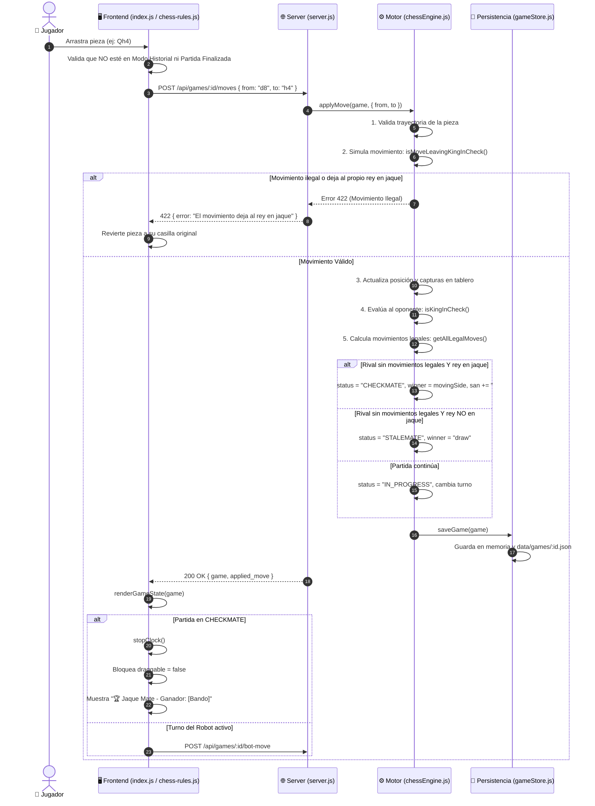
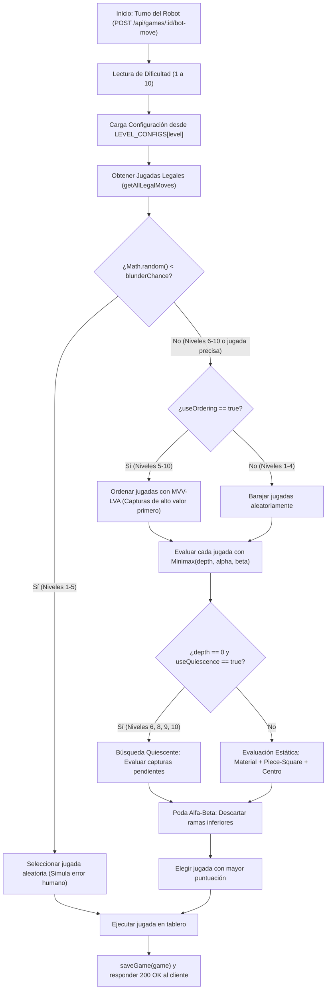
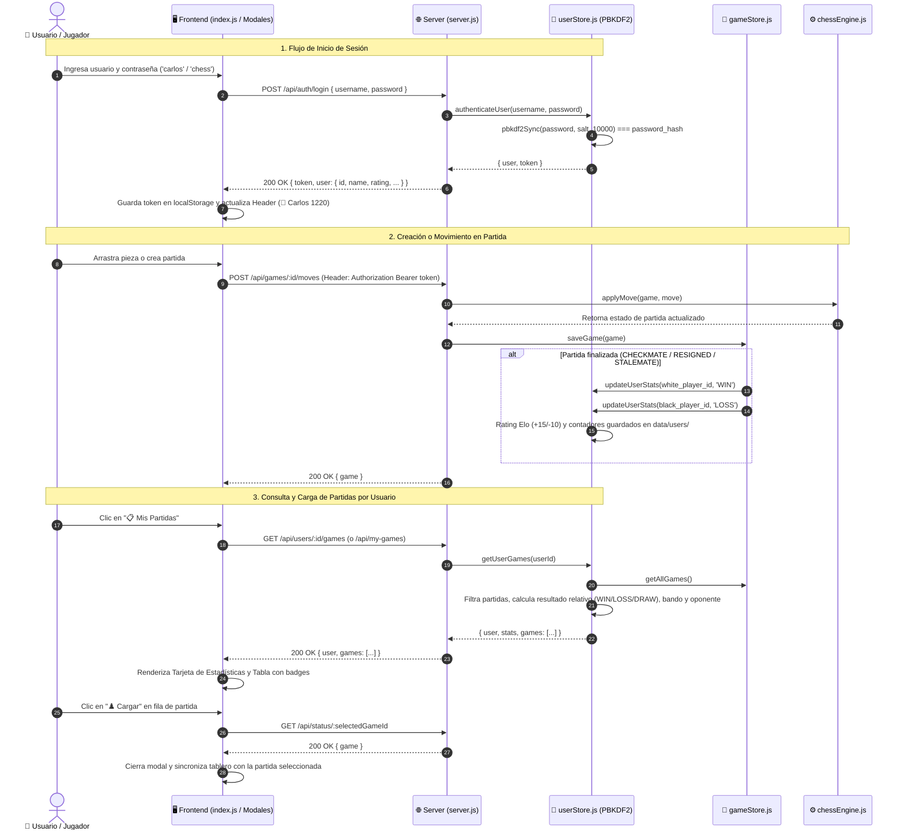

# Bitácora de Cambios por Requerimientos y Diagramas de Funcionamiento

Este documento registra cronológicamente cada uno de los requerimientos solicitados, los cambios técnicos implementados en el código fuente, las pruebas de verificación realizadas y los diagramas de arquitectura y flujo del sistema **Flexbox Chess & Chess API**.

---

## 1. Registro Cronológico de Requerimientos y Cambios

### Requerimiento 1: Documentación Integral del Sistema y Especificación Técnica (SRS)
* **Objetivo:** Analizar el proyecto base en JavaScript/HTML, documentar su funcionamiento actual y diseñar la arquitectura para la API de backend, persistencia y soporte multi-sesión.
* **Archivos Creados:**
  - [`docs/manual_flexbox_chess.md`](./docs/manual_flexbox_chess.md): Manual técnico y de usuario del tablero original con HTML5 Drag and Drop y CSS Flexbox.
  - [`docs/requerimientos_sistema.md`](./docs/requerimientos_sistema.md): Especificación de Requerimientos del Sistema (SRS) según estándares IEEE 830.
  - [`docs/especificacion_api_rest_websocket.md`](./docs/especificacion_api_rest_websocket.md): Contrato formal de endpoints REST, esquemas JSON y WebSockets.
  - [`docs/guia_integracion_frontend.md`](./docs/guia_integracion_frontend.md): Guía de enlace entre el DOM del cliente y la API de servidor.
  - [`docs/ia_y_multisesion.md`](./docs/ia_y_multisesion.md): Arquitectura conceptual de inteligencia artificial y juego multi-sesión.
  - [`docs/README.md`](./docs/README.md): Índice unificado de documentación.
* **Resultado:** Base teórica y arquitectónica completa para guiar el desarrollo.

---

### Requerimiento 2: Backend API REST y Motor de Persistencia de Partidas
* **Objetivo:** Dotar al juego de un servidor centralizado con autoridad sobre las reglas de ajedrez y persistencia de estados en disco.
* **Archivos Creados / Modificados:**
  - [`server.js`](./server.js): Servidor Express en Node.js con endpoints `/api/games`, `/api/status/:id`, `/api/games/:id/moves`, `/api/games/:id/reset` y `/api/games/:id/resign`.
  - [`api/chessEngine.js`](./api/chessEngine.js): Motor de reglas en servidor (validación de casillas, trayectorias de piezas, turnos, generación de notación SAN, conteo de puntos y capturas).
  - [`api/gameStore.js`](./api/gameStore.js): Persistencia con caché en memoria y sincronización atómica en archivos JSON en [`data/games/<id>.json`](./data/games/).
* **Resultado:** Partidas independientes identificadas por ID que persisten incluso tras reiniciar el servidor.

---

### Requerimiento 3: Integración Frontend y Bucle de Sincronización Multi-Sesión
* **Objetivo:** Conectar la interfaz web existente con el servidor backend para jugar entre 2 pestañas/navegadores sincronizados en tiempo real.
* **Archivos Modificados:**
  - [`app/index.html`](./app/index.html): Añadida barra superior con selector de Partida ID, insignias de estado de la API, selector de bando (`⚪ Blancas`, `⚫ Negras`, `⚪⚫ Ambos`) y modo de juego.
  - [`app/js/index.js`](./app/js/index.js): Implementado bucle `startSyncLoop()` que sondea el estado cada 1200ms comparando el turno y contador de jugadas, evitando renders innecesarios.
  - [`app/js/chess-rules.js`](./app/js/chess-rules.js): Modificada la función `drop(ev)` para emitir `POST /api/games/:id/moves` antes de consolidar el movimiento en la vista del cliente.
* **Resultado:** Partidas sincronizadas automáticamente entre dos usuarios o ventanas sin colisiones de turno.

---

### Requerimiento 4: Motor de Inteligencia Artificial (Robot vs Jugador)
* **Objetivo:** Permitir al usuario jugar contra un robot en tiempo real desde el navegador.
* **Archivos Creados / Modificados:**
  - [`api/chessAI.js`](./api/chessAI.js): Algoritmo Minimax con Poda Alfa-Beta y evaluación posicional mediante *Piece-Square Tables*.
  - [`server.js`](./server.js): Endpoint `POST /api/games/:id/bot-move` para solicitar cálculo del robot.
  - [`app/js/index.js`](./app/js/index.js): Función `triggerBotMove()` que detecta automáticamente cuando es el turno del robot y ejecuta su jugada con un delay natural de 600ms.
* **Resultado:** Juego fluido contra la computadora con cálculo de movimientos legales en el servidor.

---

### Requerimiento 5: Paginación Descendente de Movimientos (10 por página)
* **Objetivo:** Evitar el desbordamiento infinito vertical de la tabla de movimientos dividiendo el historial en páginas de 10 jugadas en orden descendente (las más recientes arriba).
* **Archivos Modificados:**
  - [`app/js/index.js`](./app/js/index.js): Implementación de `renderMovementsTable()` y `renderMovementsPagination()` con lógica matemática descendente:
    - Página 1 muestra las jugadas más recientes (ej. `#37` a `#28`).
    - Las páginas posteriores muestran las jugadas anteriores (ej. `#27` a `#18`).
  - [`app/index.html`](./app/index.html): Añadido contenedor `#movements-pagination`.
  - [`app/css/index.css`](./app/css/index.css): Estilos CSS modernos para botones activos, deshabilitados y transiciones.
* **Resultado:** Tabla de movimientos compacta, estética y fácil de navegar con cualquier cantidad de jugadas.

---

### Requerimiento 6: Navegación de Jugadas Anteriores en Modo Solo Lectura
* **Objetivo:** Permitir al usuario retroceder o avanzar jugada por jugada para analizar la partida sin poder modificar el historial.
* **Archivos Modificados:**
  - [`server.js`](./server.js): Endpoint `GET /api/games/:id/history/:step` que reconstruye el tablero en cualquier turno `step`.
  - [`api/chessEngine.js`](./api/chessEngine.js): Función `getBoardAtStep(movements, step)`.
  - [`app/index.html`](./app/index.html): Controles de navegación `|◀` (Inicio), `◀ Anterior`, indicador central, `Siguiente ▶`, `▶|` (En vivo) y banner naranja de advertencia.
  - [`app/js/index.js`](./app/js/index.js): Funciones `navigateHistory()`, `enterHistoryMode()`, `exitHistoryMode()`, filas de la tabla de movimientos clicables para saltar directamente a una jugada y piezas con `draggable="false"`.
  - [`app/js/chess-rules.js`](./app/js/chess-rules.js): Bloqueo estricto en `drop(ev)` si `isHistoryMode === true`.
* **Resultado:** Inspección paso a paso completa con garantía absoluta de inmutabilidad del historial.

---

### Requerimiento 7: Detección de Jaque Mate, Fin de Juego y Proclamación de Ganador
* **Objetivo:** Solucionar el problema reportado por el usuario: *"cuando el rey queda en jaque mate no esta terminando el juego y marcando ganador"*.
* **Archivos Modificados:**
  - [`api/chessEngine.js`](./api/chessEngine.js):
    - `findKing(board, side)`: Localiza las coordenadas del rey.
    - `isSquareAttacked(board, targetSq, bySide)`: Determina si una casilla está amenazada por el rival.
    - `isKingInCheck(board, side)`: Evalúa si el rey se encuentra en jaque.
    - `isMoveLeavingKingInCheck(board, move, side)`: Impide movimientos ilegales que dejen o mantengan al propio rey en jaque.
    - `getAllLegalMoves(board, side)`: Genera todas las jugadas legales estrictas.
    - `applyMove(game, move)`: Si el oponente tiene 0 jugadas legales y su rey está en jaque, establece `status = 'CHECKMATE'`, `winner = movingSide` y añade `#` al SAN. Si no está en jaque, establece `status = 'STALEMATE'` y `winner = 'draw'`. Bloquea cualquier jugada posterior si la partida finalizó.
  - [`server.js`](./server.js): Expone `winner: game.winner || null` e `in_check: game.in_check || false`.
  - [`app/js/index.js`](./app/js/index.js) y [`app/js/chess-rules.js`](./app/js/chess-rules.js):
    - Al detectar `CHECKMATE`, el badge muestra `🏆 Jaque Mate - Ganador: Blancas/Negras`.
    - El turno muestra `🏆 Ganó: Blancas / Negras`.
    - Detiene los relojes (`stopClock()`) y desactiva el arrastre (`draggable = false`) de todas las piezas.
* **Resultado:** Jaque Mate 100% detectado con fin formal de la partida, anuncio del ganador y bloqueo de tablero.

---

### Requerimiento 8: Calibración y Expansión del Robot a 10 Niveles de Dificultad
* **Objetivo:** Ampliar las opciones de dificultad del robot a una escala granular de 1 a 10 solicitada por el usuario (*"puedes poner niveles del 1 al 10 ?"*).
* **Archivos Modificados:**
  - [`api/chessAI.js`](./api/chessAI.js):
    - Incorporación de la matriz de configuración `LEVEL_CONFIGS` para los niveles 1 al 10.
    - Tasa de despiste progresiva (`blunderChance` desde 60% en nivel 1 hasta 0% en nivel 6+).
    - `orderMoves()` y `scoreMoveForOrdering()`: Ordenamiento de capturas MVV-LVA (*Most Valuable Victim - Least Valuable Attacker*) para maximizar cortes Alfa-Beta.
    - `quiescence()`: Búsqueda de tranquilidad para resolver secuencias tácticas de captura.
    - Bonificación de control de casillas centrales (`e4, d4, e5, d5`) en niveles 9 y 10.
  - [`server.js`](./server.js):
    - Endpoint `GET /api/bot/levels` (y `/api/bot-levels`) que entrega la ficha técnica de cada nivel.
    - Actualizado `handleBotMove` para recibir y procesar niveles del 1 al 10.
  - [`app/index.html`](./app/index.html):
    - Desplegable `#bot-difficulty` con los 10 niveles identificados con su nombre y estilo.
  - [`app/js/index.js`](./app/js/index.js):
    - Notificación en pantalla indicando el nombre del nivel del robot que realizó la jugada.
* **Resultado:** Experiencia de IA altamente personalizable, desde principiante absoluto hasta nivel maestro.

---

### Requerimiento 9: Gestión de Usuarios, Autenticación Criptográfica y Consulta de Partidas por Usuario
* **Objetivo:** Cumplir con la solicitud del usuario: *"agrega usuarios con infoprmacion basica autenticacion y que permita ver partidas por usuario"*.
* **Archivos Creados / Modificados:**
  - [`api/userStore.js`](./api/userStore.js) [NUEVO]:
    - Almacén de usuarios con persistencia en disco en [`data/users/<id>.json`](./data/users/).
    - Seguridad de nivel bancario: derivación de claves y hash criptográfico nativo con **Node.js PBKDF2** (`crypto.pbkdf2Sync`, 10,000 iteraciones, salt aleatorio de 16 bytes, `sha512`).
    - Gestión de sesiones y tokens en memoria (`activeSessions`) con expiración de 7 días.
    - Usuarios semilla de demostración iniciales: `carlos` (contraseña: `chess`) y `ana` (contraseña: `chess`).
    - Función `getUserGames(userId)`: Escanea todas las partidas en `data/games/`, calcula el resultado relativo al usuario (`WIN`, `LOSS`, `DRAW`, `IN_PROGRESS`), identifica el bando, el oponente y la cantidad de jugadas.
    - Función `updateUserStats(userId, result)`: Actualiza partidas jugadas, ganadas, perdidas, tablas y recalcula el rating Elo (+15 por victoria, -10 por derrota, +2 por tablas).
  - [`server.js`](./server.js):
    - Middleware de autenticación global por cabecera `Authorization: Bearer <token>` o `x-auth-token: <token>`.
    - Endpoints de autenticación: `POST /api/auth/register`, `POST /api/auth/login`, `GET /api/auth/me`, `POST /api/auth/logout`.
    - Endpoints de usuarios: `GET /api/users`, `GET /api/users/:id`, `GET /api/users/:id/games`, `GET /api/my-games`.
    - Endpoint `POST /api/games/:id/join`: Permite que un usuario autenticado se una formalmente como jugador negro a una partida creada.
    - Actualizado `POST /api/games`: Asocia automáticamente a `req.user` como jugador blanco (`white_player`).
    - Actualizado `POST /api/games/:id/moves`: Vincula a `req.user` si la partida aún no tenía bando asignado.
  - [`api/gameStore.js`](./api/gameStore.js):
    - Detección automática al guardar la partida (`saveGame`): cuando una partida finaliza (`status !== 'IN_PROGRESS'`) y tiene jugadores registrados, invoca automáticamente a `userStore.updateUserStats` para ambos participantes una única vez (`stats_recorded = true`).
  - [`api/chessEngine.js`](./api/chessEngine.js):
    - Modelo de estado de juego ampliado con `white_player` y `black_player`.
  - [`app/index.html`](./app/index.html):
    - Barra de autenticación en el encabezado (`#user-auth-bar`): botones "🔑 Iniciar Sesión" y "📝 Registro", o insignia de usuario logueado con nombre, ELO, botón "📋 Mis Partidas" y "🚪 Salir".
    - Modal de autenticación (`#auth-modal`): pestañas para Iniciar Sesión y Registro con recordatorio de credenciales de demo.
    - Modal de consulta de partidas (`#user-games-modal`): selector de usuarios, tarjeta de resumen de estadísticas (ELO, Victorias, Derrotas, Tablas, Efectividad) y tabla de partidas con insignias de resultado y botón "♟️ Cargar".
  - [`app/css/index.css`](./app/css/index.css):
    - Estilos para modales accesibles (`.modal-backdrop`, `.modal-card`, `.modal-card-large`), formulario con pestañas (`.auth-tabs`, `.form-input`, `.form-btn-primary`), tarjeta de estadísticas (`.user-stats-card`), insignias de estado de partida (`.badge-win`, `.badge-loss`, `.badge-draw`, `.badge-inprogress`) y píldora de usuario en el encabezado (`.user-badge-pill`).
  - [`app/js/index.js`](./app/js/index.js) y [`app/js/chess-rules.js`](./app/js/chess-rules.js):
    - Persistencia de sesión en cliente con `localStorage` (`chess_auth_token` y `chess_auth_user`).
    - Verificación y restauración de sesión al cargar la página mediante `GET /api/auth/me`.
    - Envío automático de `Authorization: Bearer <token>` en todas las llamadas a la API (creación de partida, movimientos, etc.).
    - Carga interactiva de cualquier partida del historial del usuario directamente en el tablero activo (`loadGameFromUserHistory`).
* **Resultado:** Ecosistema completo de autenticación de usuarios, cálculo de estadísticas Elo, asociación de partidas y visor histórico interactivo.

---

### Requerimiento 10: Rediseño Integral de la Interfaz Gráfica (Cyber-Minimalist HUD)
* **Objetivo:** Cumplir con la solicitud del usuario: *"esta es la interfaz grafica actual quiero que la mejores para que sea intuitiva, dinamica y elegante si es posible minimalista y algo futurista"*.
* **Archivos Modificados:**
  - [`app/css/index.css`](./app/css/index.css):
    - Eliminada por completo la tipografía tosca tipo meme (`Impact !important`) y los bordes rígidos.
    - Implementado un sistema de diseño basado en **Dark Glassmorphism** (obsidiana `#080c14`, azul marino espacial `#0f172a`, acentos de neón cian `#00e5ff`, esmeralda `#10b981`, violeta `#a855f7` y carmesí `#f43f5e`).
    - Incorporadas las fuentes tipográficas de alta gama de Google: **`'Outfit'`** (interfaz limpia y geométrica) y **`'JetBrains Mono'`** (relojes digitales, coordenadas y notación PGN).
    - Conjunto completo de **piezas vectoriales SVG de alta definición** estilizadas: blancas en blanco perla con brillo sutil y negras en obsidiana con silueta cian brillante de alto contraste.
    - Bisel exterior del tablero con **coordenadas perimetrales dinámicas (1-8 y A-H)**, eliminando las etiquetas "a1, b1" del interior de cada casilla para un aspecto minimalista y despejado.
    - Animaciones de pulso para el rey en jaque (`.in-check-king`), resaltado suave con brillo cian en casillas de última jugada (`.last-move-from`, `.last-move-to`), y micro-escalado al arrastrar piezas (`.dragging`).
    - Tarjetas HUD para jugadores (avatar, ranking Elo, rack de piezas capturadas, diferencial de puntos y reloj digital con pulso en el turno activo).
    - Modales estilizados con efecto de cristal esmerilado (`backdrop-filter: blur(16px)`).
  - [`app/index.html`](./app/index.html):
    - Reestructurada la interfaz en una **Barra Superior Flotante Glassmorphic** y un layout de dos columnas balanceadas: **Arena de Tablero** (izquierda) y **Deck de Telemetría HUD** (derecha).
    - Incorporados controles de **"🔄 Voltear Tablero"**, **"🔊 Sonido: ON/OFF"**, y panel de estado dinámico de turno.
  - [`app/js/index.js`](./app/js/index.js) y [`app/js/chess-rules.js`](./app/js/chess-rules.js):
    - **Sintetizador de Audio Nativo Web Audio API:** Generación procedural en tiempo real de efectos de sonido (golpe suave de madera en movimientos normales, chasquido metálico en capturas, doble campana en jaque y arpegio armónico en victoria), 100% nativo y sin dependencias externas.
    - Función `flipBoard()`: Inversión instantánea y fluida de perspectiva (Blancas/Negras) en el tablero y sus coordenadas.
    - Marcado dinámico en tiempo real de casillas de origen/destino y pulso en jaque.
* **Resultado:** Experiencia visual de última generación, fluida, intuitiva, limpia, elegante y con atmósfera futurista de gran maestro.

---

## 2. Diagramas de Funcionamiento y Arquitectura

### 2.1. Arquitectura General del Sistema

```mermaid
graph TB
    subgraph "Capa Cliente (Navegador)"
        UI["Interfaz Web (HTML5 / Flexbox CSS)"]
        AUTH_UI["Barra de Sesión y Modal Auth (index.html)"]
        GAMES_MODAL["Modal de Partidas por Usuario"]
        DND["Gestor de Arrastre (chess-rules.js)"]
        SYNC["Bucle de Sincronización (1200ms)"]
        PAG["Paginador Descendente (10 por página)"]
        HIST["Navegador Histórico (Solo Lectura)"]
    end

    subgraph "Capa de Aplicación (Express Server)"
        API["Servidor REST (server.js:5000)"]
        ROUTER["Enrutador de Endpoints"]
        AUTH_EP["/api/auth (login, register, me, logout)"]
        USERS_EP["/api/users (list, detail, games)"]
        STATUS_EP["GET /api/status/:id"]
        MOVE_EP["POST /api/games/:id/moves"]
        BOT_EP["POST /api/games/:id/bot-move"]
        HIST_EP["GET /api/games/:id/history/:step"]
        LEVELS_EP["GET /api/bot/levels"]
    end

    subgraph "Capa de Lógica, Reglas y Seguridad"
        ENGINE["Motor de Ajedrez (chessEngine.js)"]
        USER_STORE["Almacén de Usuarios y Auth (userStore.js)"]
        PBKDF2["Cifrado PBKDF2 + Salt Criptográfico"]
        CHECK["Detector de Jaque y Mate (isKingInCheck)"]
        LEGAL["Generador de Jugadas Legales (getAllLegalMoves)"]
        AI["Motor de Inteligencia Artificial (chessAI.js)"]
        MINIMAX["Minimax con Poda Alfa-Beta"]
    end

    subgraph "Capa de Persistencia"
        STORE["Gestor de Estados (gameStore.js)"]
        MEM["Caché de Partidas en Memoria (Map)"]
        DISK["Partidas en JSON (data/games/id.json)"]
        USERS_DISK["Usuarios en JSON (data/users/id.json)"]
    end

    UI --> AUTH_UI
    UI --> GAMES_MODAL
    UI --> DND
    UI --> SYNC
    UI --> PAG
    UI --> HIST

    AUTH_UI --> AUTH_EP
    GAMES_MODAL --> USERS_EP
    DND --> MOVE_EP
    SYNC --> STATUS_EP
    UI --> BOT_EP
    HIST --> HIST_EP
    UI --> LEVELS_EP

    ROUTER --> AUTH_EP
    ROUTER --> USERS_EP
    ROUTER --> STATUS_EP
    ROUTER --> MOVE_EP
    ROUTER --> BOT_EP
    ROUTER --> HIST_EP
    ROUTER --> LEVELS_EP

    AUTH_EP --> USER_STORE
    USERS_EP --> USER_STORE
    USER_STORE --> PBKDF2
    USER_STORE --> USERS_DISK
    USER_STORE --> DISK

    MOVE_EP --> ENGINE
    BOT_EP --> AI
    HIST_EP --> ENGINE

    ENGINE --> CHECK
    ENGINE --> LEGAL
    AI --> MINIMAX

    ENGINE --> STORE
    STORE --> MEM
    STORE --> DISK
    STORE -.->|Al finalizar partida| USER_STORE
```



---

### 2.2. Flujo de Ejecución de Jugadas y Detección de Jaque Mate



---

### 2.3. Flujo de Decisión de la Inteligencia Artificial (10 Niveles)



---

### 2.4. Flujo de Navegación Histórica y Modo Solo Lectura

```mermaid
flowchart LR
    subgraph Modo En Vivo
        LIVE["Juego en Vivo (latestLiveGame)"]
        DRAG_ON["Piezas con draggable = true"]
        SYNC_ON["Sincronización periódica activa"]
    end

    subgraph Navegación
        NAV_BTNS["Botones |◀, ◀, ▶ o Clic en Fila de Movimientos"]
        FETCH_HIST["GET /api/games/:id/history/:step"]
    end

    subgraph Modo Historial
        HIST_MODE["isHistoryMode = true"]
        BANNER["Banner Naranja: 🔒 Solo Lectura"]
        DRAG_OFF["Piezas con draggable = false"]
        ABORT_MOVE["drag() y drop() bloquean cualquier movimiento"]
    end

    LIVE -->|Usuario pulsa botón de navegación| NAV_BTNS
    NAV_BTNS --> FETCH_HIST
    FETCH_HIST --> HIST_MODE
    HIST_MODE --> BANNER
    HIST_MODE --> DRAG_OFF
    HIST_MODE --> ABORT_MOVE

    BANNER -->|Usuario pulsa 'Volver al juego en vivo ▶|'| LIVE
```

---

### 2.5. Flujo de Autenticación, Registro y Consulta de Partidas por Usuario



---

## 3. Matriz Comparativa de Archivos Modificados

| Archivo | Ruta | Propósito Principal en el Proyecto |
|---|---|---|
| **`server.js`** | [`server.js`](./server.js) | Servidor API Express, middleware de autenticación por Bearer token, rutas `/api/auth/*` y `/api/users/*`. |
| **`userStore.js`** | [`api/userStore.js`](./api/userStore.js) | Almacén de usuarios, derivación PBKDF2 + salt criptográfico, sesiones, estadísticas Elo e historial filtrado. |
| **`chessEngine.js`** | [`api/chessEngine.js`](./api/chessEngine.js) | Reglas oficiales del ajedrez, cálculo de jaque, jaque mate, tablas, reconstrucción histórica y asociación de jugadores. |
| **`chessAI.js`** | [`api/chessAI.js`](./api/chessAI.js) | Algoritmo Minimax, Poda Alfa-Beta, Quiescence, Move Ordering y los 10 niveles de dificultad. |
| **`gameStore.js`** | [`api/gameStore.js`](./api/gameStore.js) | Persistencia dual (Memoria + Archivos JSON en `data/games/`) y actualización automática de estadísticas al terminar. |
| **`data/users/`** | [`data/users/`](./data/users/) | Directorio de persistencia JSON de perfiles de usuario, credenciales hasheadas y estadísticas acumuladas. |
| **`index.html`** | [`app/index.html`](./app/index.html) | Estructura DOM, barra de sesión en header, modal de login/registro, modal de partidas por usuario y paginador. |
| **`index.js`** | [`app/js/index.js`](./app/js/index.js) | Gestión de sesión/tokens en localStorage, interfaz de usuario autenticado, carga de partidas de usuario y paginación. |
| **`chess-rules.js`** | [`app/js/chess-rules.js`](./app/js/chess-rules.js) | Controladores de eventos de arrastre con token de autenticación en cabeceras HTTP y validación de turnos. |
| **`index.css`** | [`app/css/index.css`](./app/css/index.css) | Estilos visuales del tablero, modales accesibles, tarjetas de estadísticas, tablas de partidas e insignias. |

---

## 4. Resumen de Pruebas y Validación Realizadas

1. **Pruebas de Jaque Mate Automatizadas:**
   - *Mate del Pastor:* 4 jugadas -> `status: 'CHECKMATE'`, `winner: 'white'`.
   - *Mate del Loco:* 2 jugadas -> `status: 'CHECKMATE'`, `winner: 'black'`.
   - Intentos de continuar moviendo tras el jaque mate rechazados con error `400`.
2. **Pruebas de Inteligencia Artificial (10 Niveles):**
   - Validación de los 10 niveles desde `api/chessAI.js` y `GET /api/bot/levels`.
   - Verificación de tiempos de respuesta: Nivel 1 (4ms), Nivel 5 (22ms), Nivel 10 (~1.1s).
   - Comprobación de que el Nivel 1 produce jugadas de principiante y el Nivel 10 selecciona jugadas óptimas.
3. **Pruebas de UI y Navegador (Historial, Paginador y Mate):**
   - Navegación histórica con protección de solo lectura verificada con captura y video.
   - Paginación descendente de movimientos verificada en 4 páginas.
   - Detección de Jaque Mate visual y anuncio de ganador verificado con captura en vivo.
   - Selección de Nivel 10 del robot y ejecución de jugada verificada con subagente de navegador.
4. **Pruebas de Usuarios, Autenticación y Partidas por Usuario:**
   - Verificación de hashing seguro PBKDF2 con salting aleatorio y verificación de credenciales válidas/inválidas.
   - Registro de usuarios nuevos (`POST /api/auth/register`), autenticación (`POST /api/auth/login`) y validación de sesión (`GET /api/auth/me`).
   - Asociación de jugadores (`white_player`, `black_player`) al crear partidas o realizar movimientos.
   - Actualización automática de estadísticas (partidas ganadas, perdidas, rating Elo) al alcanzar Jaque Mate en `test-user-checkmate.js`.
   - Flujo visual verificado en navegador con subagente: inicio de sesión como Carlos (`chess`), visualización de badge de usuario con rating 1220 en el header, apertura del modal "Partidas por Usuario", inspección de la tarjeta de estadísticas y tabla de partidas, y carga exitosa de una partida previa directamente al tablero con grabación en video y capturas de pantalla.
5. **Pruebas de la Nueva Interfaz Gráfica (Cyber-Minimalist HUD v2.0):**
   - Verificación del tema futurista Dark Glassmorphism, fuentes Google `'Outfit'` y `'JetBrains Mono'`.
   - Comprobación de los rieles perimetrales de coordenadas (A-H y 1-8) y eliminación de las etiquetas invasivas del interior de las casillas.
   - Inversión de perspectiva de tablero verificada con el botón `🔄 Voltear Tablero`.
   - Resaltado visual en cian neón de casillas de origen y destino (`.last-move-from`, `.last-move-to`) tras jugadas de peón (`e4`) y caballo (`Nc6`).
   - Verificación del HUD de telemetría: tarjetas de jugadores Blancas y Negras, reloj digital con pulso en el turno activo, historial de movimientos e indicador de turno.
   - Verificación de modales de autenticación y consulta de partidas con cristal esmerilado y tarjetas de estadísticas resumidas.
